# PlaySmart – Phase 3: Low-Fidelity Design and Interaction Planning

**Project Title:** PlaySmart – A Human-Centered Football Training and Performance Planning Interface

**Team Members:** Usman Wajid, Ahmad Masood, Abdulrehman Naseer

**Instructor:** Arslan Asif

**Date:** April 2025

---

## Table of Contents

1. [Introduction](#1-introduction)
2. [Low-Fidelity Prototypes](#2-low-fidelity-prototypes)
   - 2.1 Storyboards
   - 2.2 Wireframes – Main Design
   - 2.3 Wireframes – Alternative Design
3. [Design Goals](#3-design-goals)
   - 3.1 Usability Goals (Quantitative)
   - 3.2 Usability Goals (Qualitative)
   - 3.3 User Experience (UX) Goals
4. [User Evaluation Activity](#4-user-evaluation-activity)
   - 4.1 Overall Feedback
   - 4.2 Usability Issues Identified
   - 4.3 Wireframe Comparison
   - 4.4 Improvements for Next Iteration
5. [Conclusion](#5-conclusion)

---

## 1. Introduction

This phase builds on the research and requirements gathered in Phases 1 and 2 of the PlaySmart project. The objective of this phase is to translate the requirements, personas, and scenarios into early design representations that can be evaluated and refined before moving to higher-fidelity designs.

PlaySmart is a conceptual mobile-based interface designed to support football players and coaches in planning, organizing, and reviewing training activities through intuitive and user-friendly interaction. The system focuses on simplifying training management while reducing cognitive load for users.

In this phase, we present:
- **Storyboards** illustrating key user interactions
- **Wireframes** for major system screens (two alternative designs)
- **Defined usability and UX goals** to guide future evaluation
- **User evaluation feedback** from the assigned user group

The wireframes have been created as low-fidelity grayscale prototypes following standard HCI wireframing rules (no color, image placeholders, standard UI symbols):
- **Main Design (Lo-Fi Wireframes):** [PlaySmart Lo-Fi Wireframes – Stitch](https://stitch.withgoogle.com/projects/14852019868932687382)
- **Alternative Design:** Described in Section 2.3 below

---

## 2. Low-Fidelity Prototypes

### 2.1 Storyboards (Early Low-Fidelity Prototypes)

Storyboards visually illustrate how users interact with the PlaySmart system in different situations. Each storyboard represents a sequence of steps showing how a user performs a task using the system.

---

#### Storyboard 1: Player Planning a Solo Training Session

This storyboard illustrates Ahmad's journey from unstructured training to guided, app-assisted practice using PlaySmart.

**Frame 1 — The Problem: Arriving Without Direction**

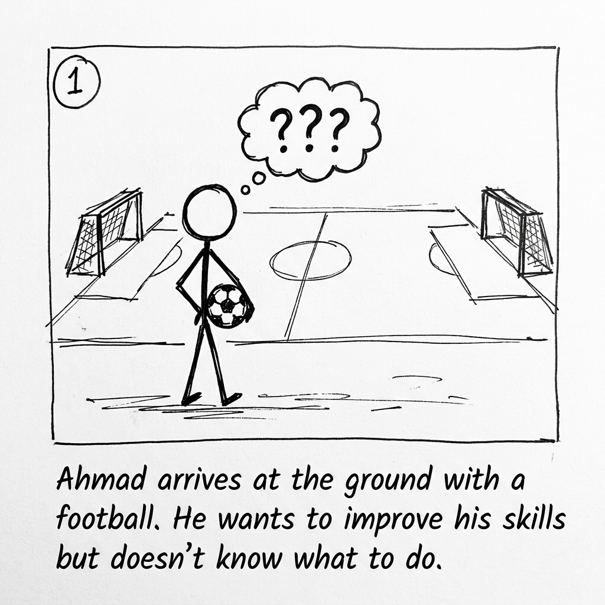

Ahmad, a 21-year-old university football player, arrives at the football ground carrying his ball. He wants to improve his skills before an upcoming tournament but feels lost — he doesn't know which drills to practice or how to structure his training session.

---

**Frame 2 — Unstructured Training Environment**

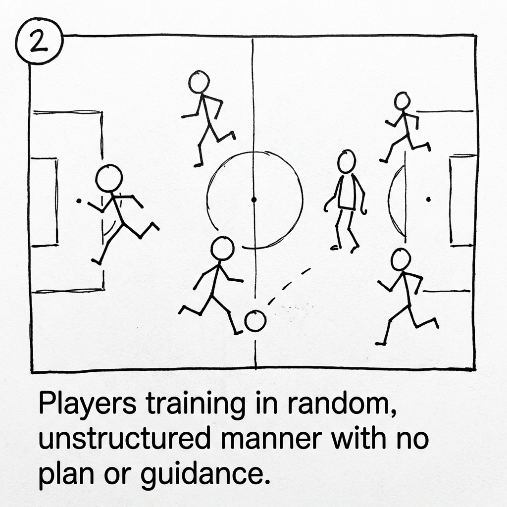

At the ground, Ahmad sees other players training in a completely random and unstructured manner — some kicking balls aimlessly, some jogging, others standing around. There's no organized training plan, no guidance, and no measurable progress being made.

---

**Frame 3 — Discovering PlaySmart**

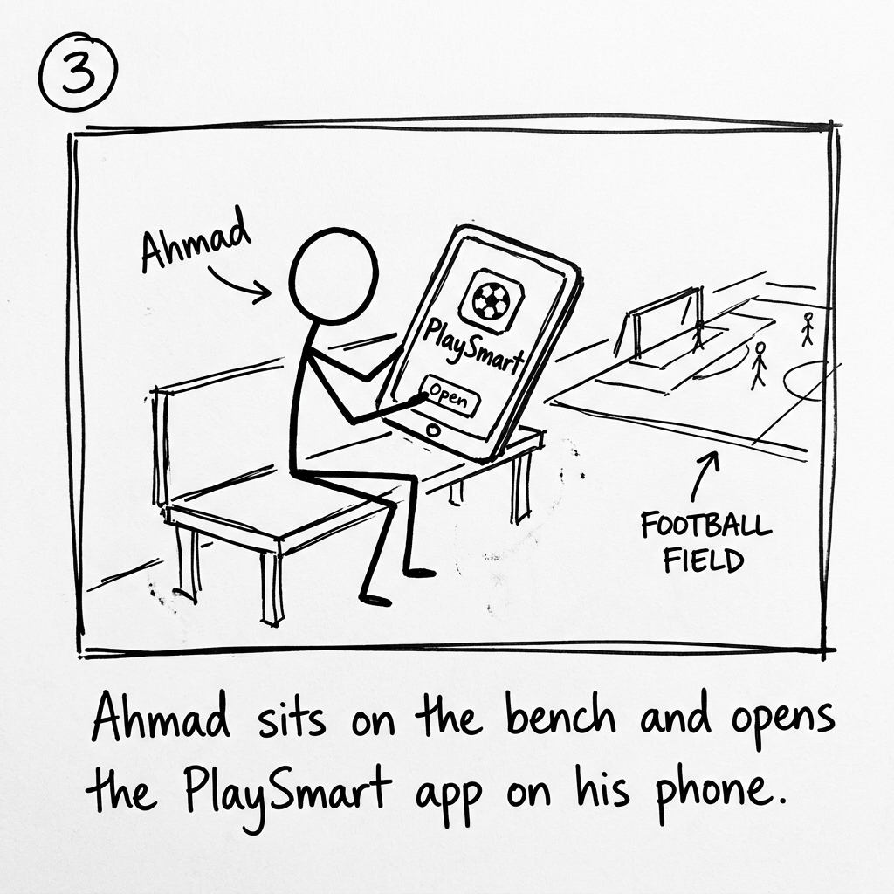

Frustrated, Ahmad sits down on a bench beside the field and pulls out his phone. He opens the **PlaySmart** app, which greets him with a clean, intuitive splash screen featuring the app logo and a football icon.

---

**Frame 4 — Browsing Training Categories & Selecting Drills**

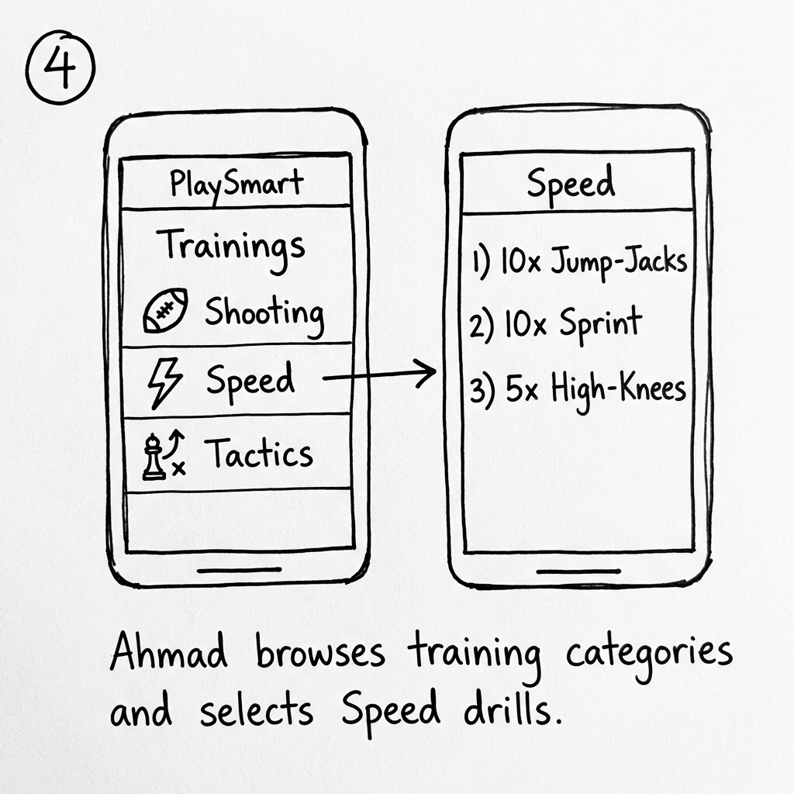

The app displays the **Trainings** screen with three organized categories: **Shooting** ⚽, **Speed** ⚡, and **Tactics** 🧩. Ahmad taps on "Speed" and sees a structured drill list:
1. 10x Jump-Jacks
2. 10x Sprint  
3. 5x High-Knees

Each drill has clear rep counts and instructions.

---

**Frame 5 — Performing the Exercises**

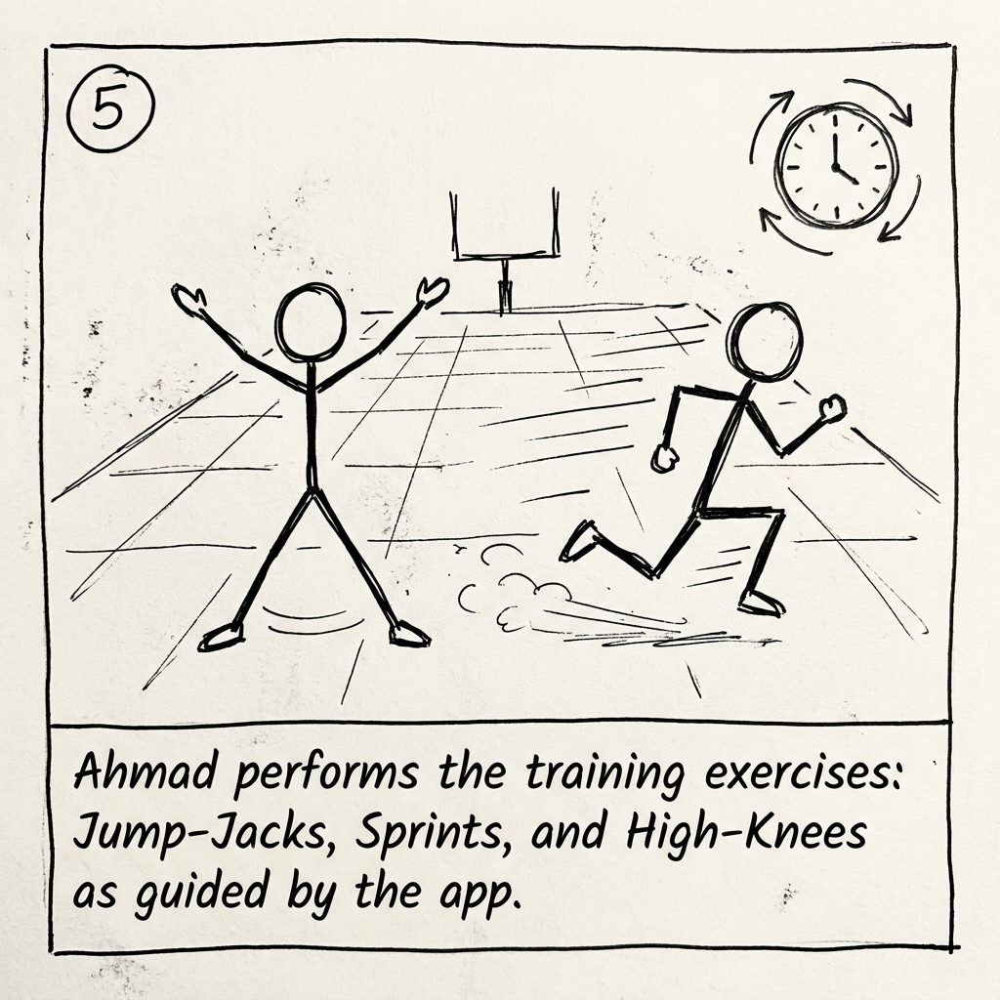

Ahmad follows the app's guidance and performs each exercise on the field. He does jump-jacks, sprints, and high-knees as instructed. The app tracks his progress in real time, and a timer keeps him on schedule throughout the session.

---

**Frame 6 — Training Completed Successfully**

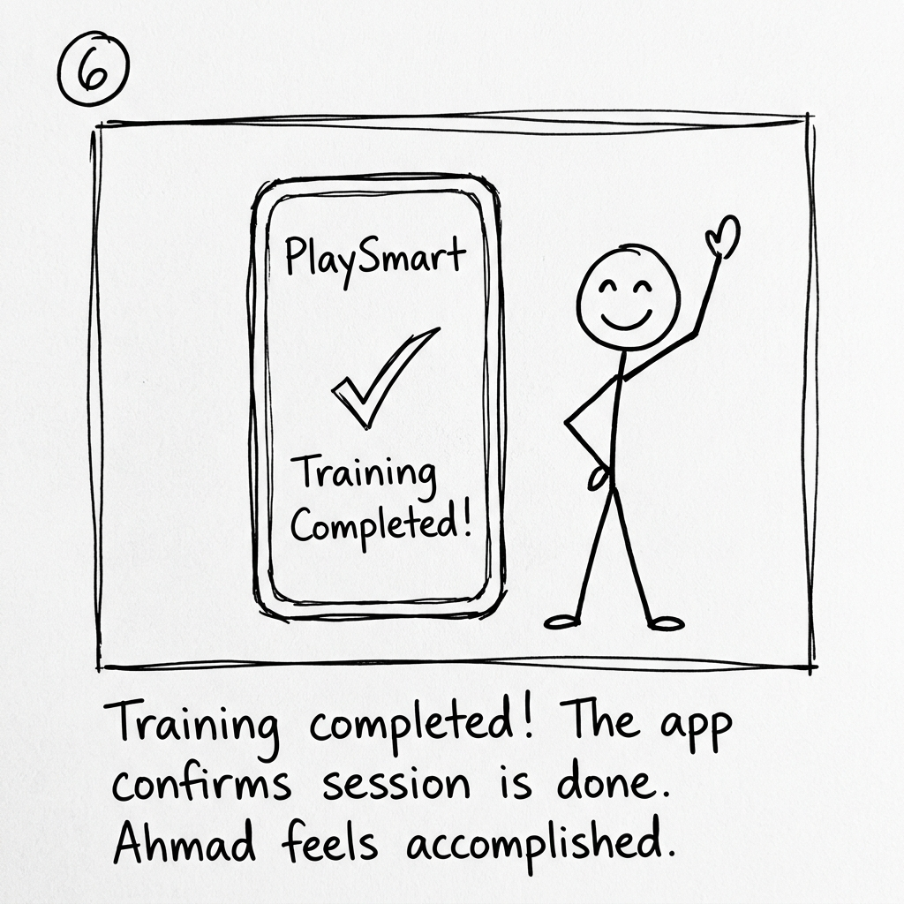

After completing all exercises, the app displays a **"Training Completed!"** screen with a green checkmark. Ahmad sees his session summary — total time, exercises completed, and an encouraging message. He feels accomplished and motivated to continue using PlaySmart for his daily training.

---

#### Storyboard 2: Coach Organizing a Team Training Session

| Step | Scene Description |
|------|-------------------|
| **1** | **Context:** Hamza, a university football coach, needs to organize a training session focusing on passing accuracy and teamwork for the upcoming match. He usually plans manually, which takes considerable time. |
| **2** | **Action:** Hamza opens the PlaySmart app on his tablet. The coach dashboard shows options: "Create Session," "Drill Library," "Player Roster," and "Session History." |
| **3** | **Action:** He taps "Create Session" and selects the date and training focus (Passing, Teamwork, Small-sided Games). |
| **4** | **Action:** The system filters the drill library to show relevant exercises. Hamza browses through visual drill cards showing drill name, duration, equipment needed, and skill focus area. |
| **5** | **Action:** Hamza selects exercises for warm-up (10 min), skill drills (25 min), and a practice match (20 min). The app auto-arranges them into a structured session plan. |
| **6** | **Action:** During training, players follow the drill sequence displayed on Hamza's tablet. Each drill card shows instructions, player formations, and objectives. |
| **7** | **Action:** After the session, Hamza records quick notes about individual player performance using a simple rating system (1–5 stars) and short text notes. |
| **8** | **Outcome:** The system stores session data. Hamza can review player progress over time and adjust future training plans accordingly. The session summary shows total training time, drills completed, and player ratings. |

---

#### Storyboard 3: Team Preparing for a Match

| Step | Scene Description |
|------|-------------------|
| **1** | **Context:** The university football team has an important match next week. Coach Hamza wants to ensure players are fully prepared. He decides to use PlaySmart's Match Preparation feature. |
| **2** | **Action:** Hamza opens PlaySmart and navigates to "Match Prep." The system displays a pre-match checklist: Fitness Check, Tactical Drills, Warm-up Plan, and Mental Readiness. |
| **3** | **Action:** He reviews the team's recent training data. The app highlights players with high fatigue levels (shown with red/yellow indicators) who may need lighter training. |
| **4** | **Action:** Hamza creates a match-day preparation plan with modified intensity for fatigued players and full training for fit players. |
| **5** | **Action:** Ahmad (a player) opens the app on his phone and sees his personalized match-day schedule, including warm-up drills and tactical instructions. |
| **6** | **Action:** After the preparation session, Hamza uses the "Readiness Check" feature where players self-report their physical and mental readiness (scale 1–10). |
| **7** | **Outcome:** The system generates a team readiness overview showing all players' status. Hamza feels confident the team is prepared, and players appreciate the structured approach. |

---

### 2.2 Wireframes – Main Design

The main design wireframes follow standard low-fidelity wireframing principles:
- **No Color:** Only grayscale (white, black, and gray)
- **Placeholders:** Rectangles with "X" for images, simple lines for text
- **Standard Symbols:** Common UI patterns (magnifying glass for search, chevrons for navigation)

**Interactive Prototype Link:** [PlaySmart Lo-Fi Wireframes – Stitch](https://stitch.withgoogle.com/projects/14852019868932687382)

#### Wireframe Screens

**Splash / Welcome Screen & Login Screen**

| | |
|:---:|:---:|
| 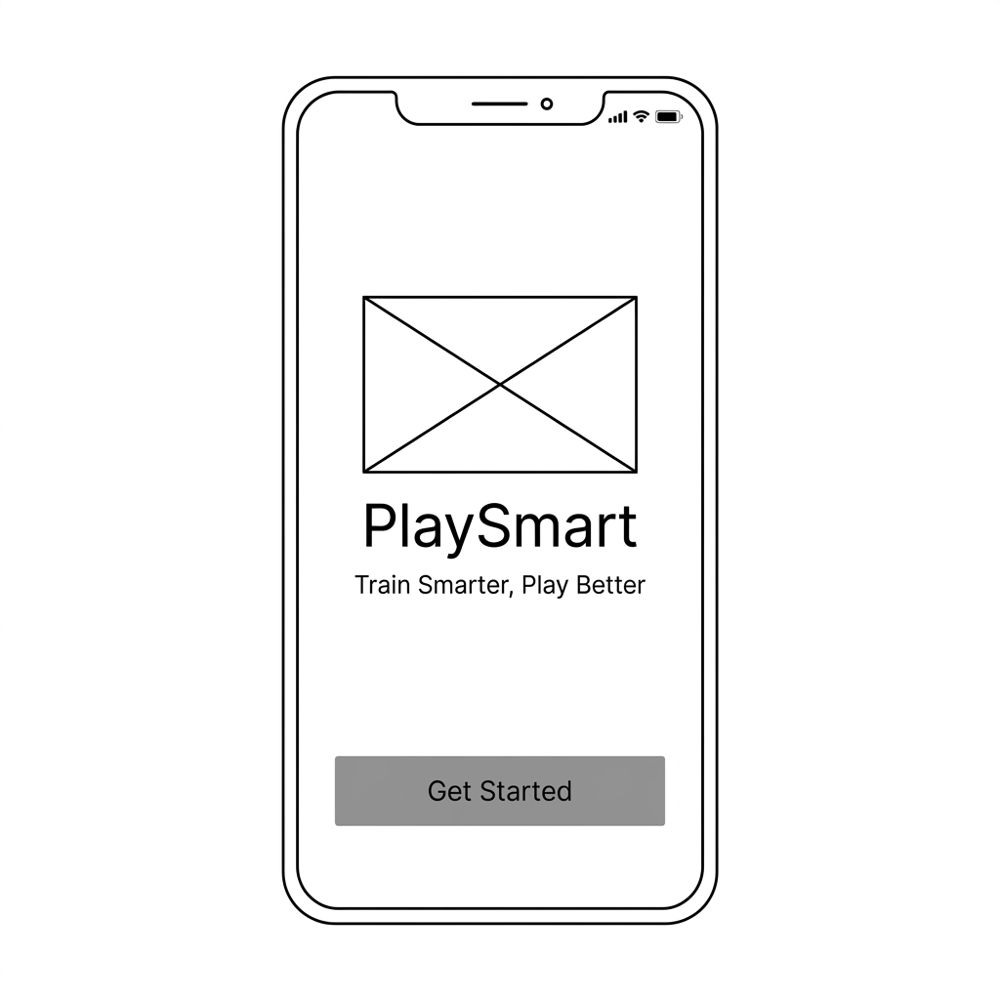 | 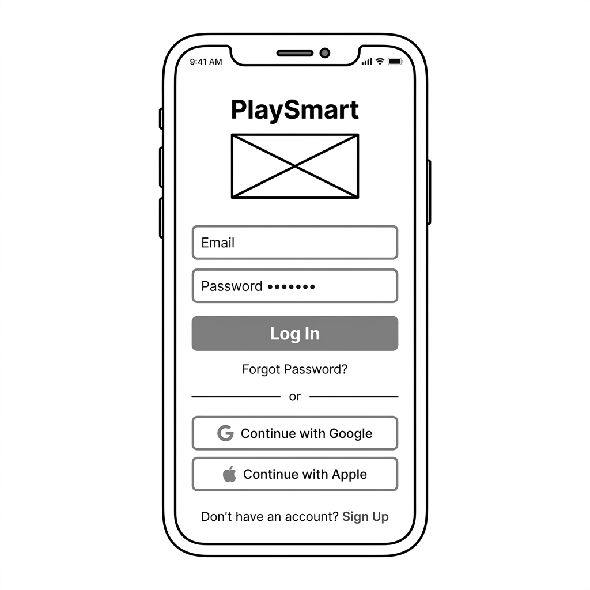 |
| *Splash / Welcome Screen* | *Login / Registration* |

**Player Dashboard & Training Categories**

| | |
|:---:|:---:|
| 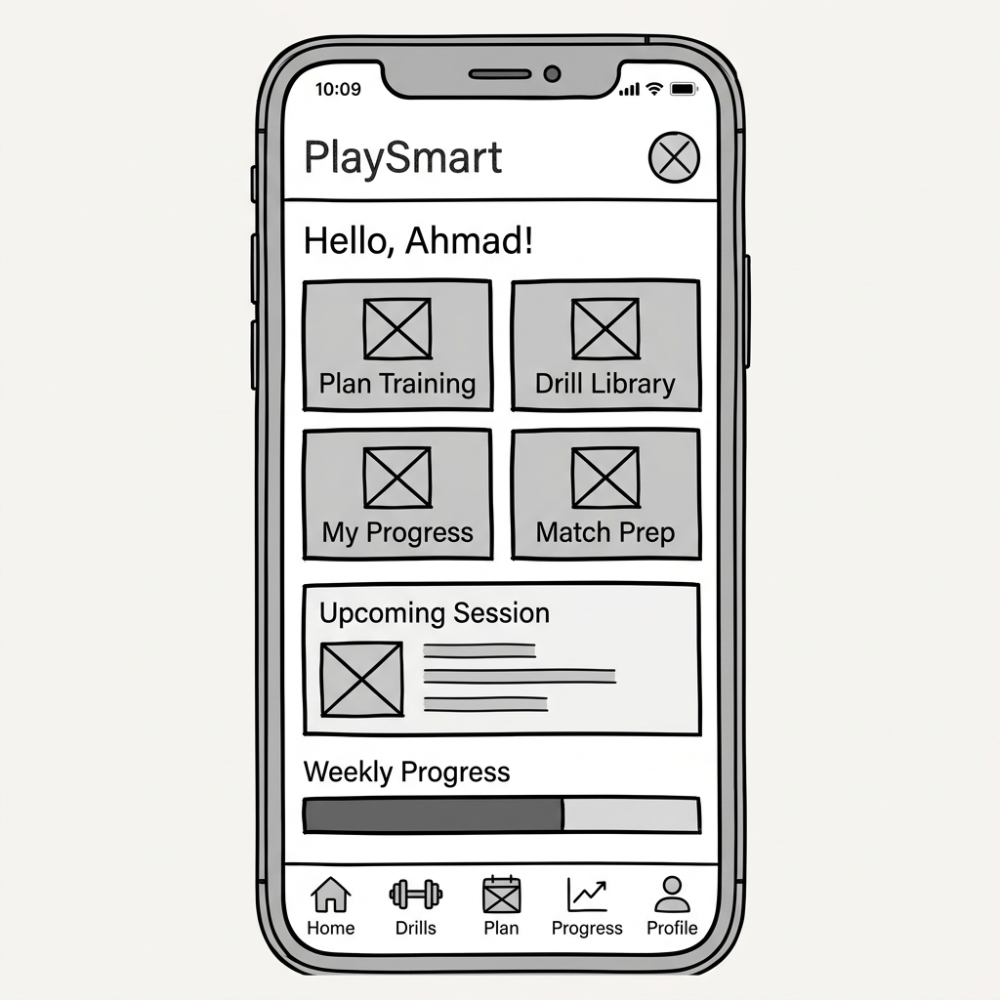 | 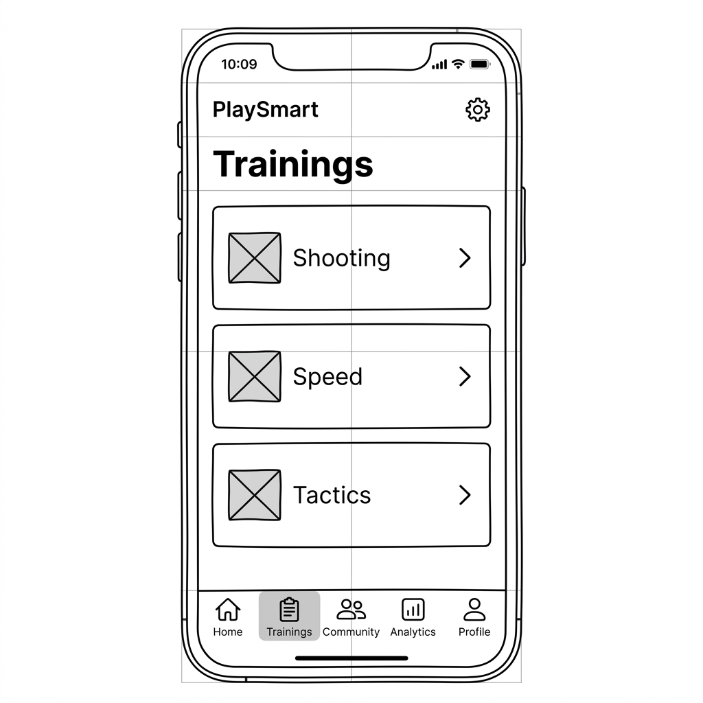 |
| *Home Dashboard (Player)* | *Training Categories* |

**Speed Training Detail & Drill Library**

| | |
|:---:|:---:|
| 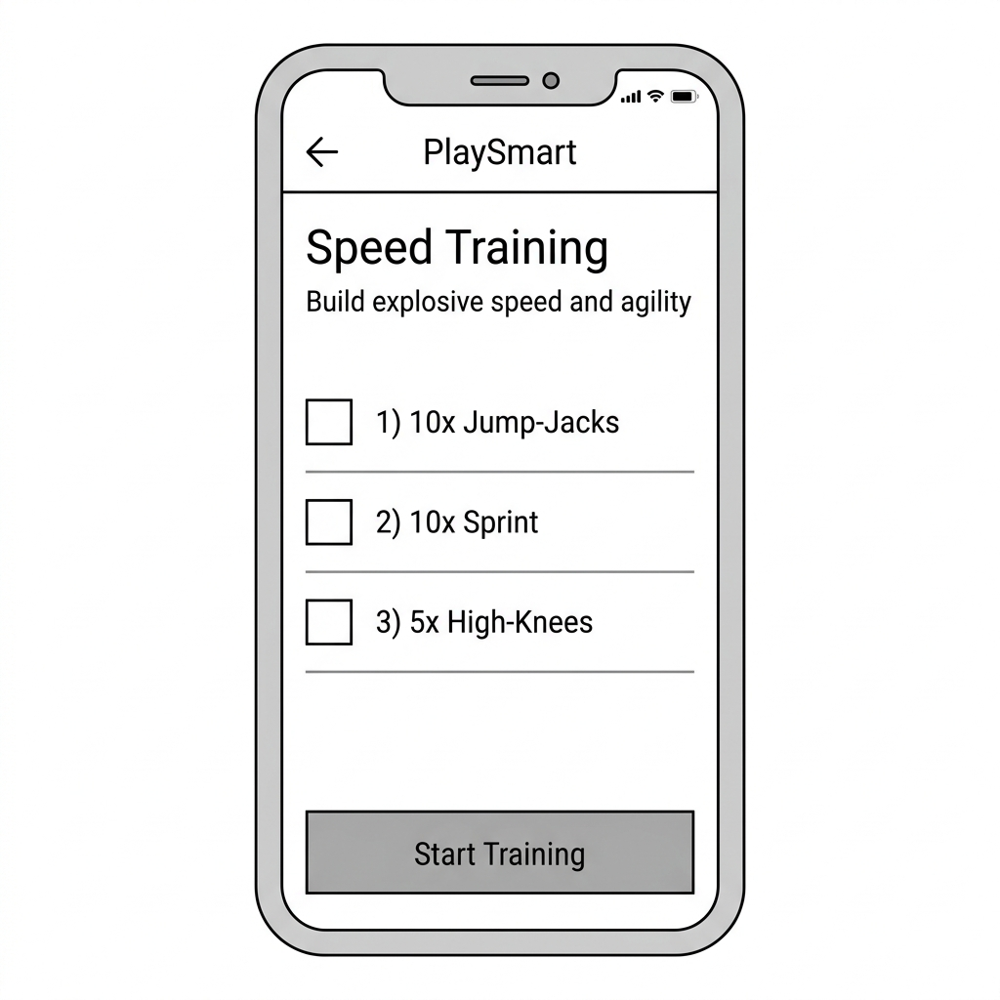 | 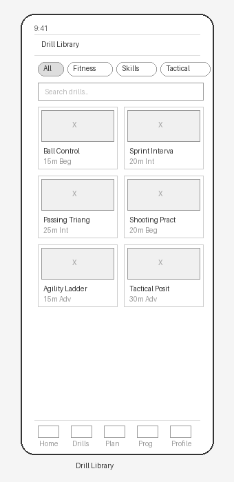 |
| *Speed Training Detail* | *Drill Library* |

**Training Completed & Player Progress**

| | |
|:---:|:---:|
| 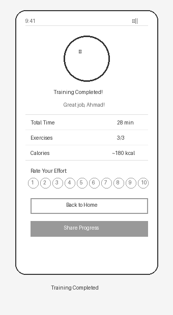 | 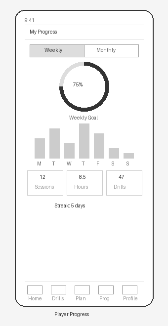 |
| *Training Completed* | *Player Progress* |

The main design focuses on the following key screens and features:

#### Screen Descriptions

| Screen | Description |
|--------|-------------|
| **Splash / Welcome Screen** | App logo, tagline "Train Smarter, Play Better," and Get Started button |
| **Login / Registration** | Simple login form with email/password fields, social login options, and registration link |
| **Home Dashboard (Player)** | Central hub showing quick actions: Plan Training, Drill Library, My Progress, Match Prep. Displays upcoming session card and weekly progress bar |
| **Home Dashboard (Coach)** | Coach-specific view with: Create Session, Player Roster, Drill Library, Session History. Shows team overview and next scheduled session |
| **Drill Library** | Grid/list view of drills with category filters (Fitness, Skills, Tactical). Each drill card shows: name, duration, difficulty, and equipment |
| **Drill Detail** | Full drill description with step-by-step instructions, visual diagram/illustration, duration, and "Add to Session" button |
| **Training Plan / Calendar** | Weekly calendar view showing scheduled sessions. Users can drag-and-drop drills into time slots |
| **Session Creation (Coach)** | Multi-step form: Select Date → Choose Focus → Pick Drills → Review Plan → Create Session |
| **Player Progress** | Visual dashboard showing: sessions completed, drills finished, weekly/monthly trends using simple bar charts |
| **Workload & Fatigue Tracker** | Manual input screen for perceived effort (RPE scale 1–10). Visual fatigue heatmap showing training load over time |
| **Match Preparation** | Pre-match checklist with readiness indicators. Training suggestions based on upcoming match date |
| **Session Summary** | Post-training overview: drills completed, total time, player ratings (coach view), and improvement notes |
| **Settings / Profile** | User profile, notification preferences, and account management |

#### Navigation Structure (Main Design)

```
Bottom Navigation Bar:
├── Home (Dashboard)
├── Drills (Library)
├── Plan (Training Calendar)
├── Progress (Tracking)
└── Profile (Settings)
```

---

### 2.3 Wireframes – Alternative Design 1

The alternative design wireframes are available in Figma:
**Link:** [Alternative Design 1 – Figma](https://www.figma.com/make/f8gpGhvqfnCadzPZSdnxCw/alterntive-1)

The alternative design explores different layout and navigation approaches:

#### Key Differences from Main Design

| Aspect | Main Design | Alternative Design 1 |
|--------|-------------|---------------------|
| **Navigation** | Bottom tab bar with 5 tabs | Side drawer/hamburger menu navigation |
| **Dashboard Layout** | Card-based grid layout with quick actions | List-based layout with expandable sections |
| **Drill Library** | Grid view with visual drill cards | List view with filter sidebar |
| **Training Plan** | Calendar-based weekly view | Timeline-based sequential view |
| **Progress Display** | Bar charts and trend lines | Circular progress rings and milestone badges |
| **Coach View** | Separate dashboard tab | Integrated toggle switch between Player/Coach mode |

#### Alternative Screen Descriptions

| Screen | Description |
|--------|-------------|
| **Home Screen** | List-based dashboard with expandable sections for Recent Activity, Upcoming Sessions, and Quick Start options |
| **Drill Browser** | Left-panel filter sidebar with main content area showing drill list. Filters include: Category, Difficulty, Duration, Equipment |
| **Session Timeline** | Vertical timeline showing past and upcoming sessions with status indicators (completed, upcoming, missed) |
| **Progress Rings** | Circular progress indicators for weekly goals: Drills Completed, Training Hours, Skill Improvement |
| **Quick Drill Start** | Simplified flow: Select Category → Get Recommended Drill → Start Timer → Mark Complete |
| **Team Overview (Coach)** | Grid of player cards showing individual readiness, recent activity, and performance rating |

---

## 3. Design Goals

### 3.1 Usability Goals (Quantitative)

These are measurable objectives that define how effectively users can interact with the PlaySmart system:

| Goal | Metric | Target |
|------|--------|--------|
| **Task Completion Time** | Time to create a training session | ≤ 3 minutes for new users; ≤ 1 minute for returning users |
| **Task Completion Time** | Time to find and start a specific drill | ≤ 30 seconds |
| **Error Rate** | Percentage of user actions resulting in errors (e.g., failed session creation, invalid inputs) | < 5% of user actions |
| **Learnability** | Time for a new user to perform basic tasks (plan a session, browse drills, log a workout) without assistance | ≤ 5 minutes |
| **Efficiency** | Number of taps/interactions to complete common tasks | ≤ 4 taps to start a drill; ≤ 6 taps to create a training session |
| **Task Success Rate** | Percentage of users able to successfully complete core tasks without help | ≥ 90% on first attempt |
| **System Usability Scale (SUS)** | Standardized usability questionnaire score | ≥ 72 (above average) |

### 3.2 Usability Goals (Qualitative)

These describe the subjective quality attributes the system should exhibit:

- **Ease of Use:** The interface should be simple and intuitive, even for first-time users with limited technical expertise. Players should be able to use the app on the field during training without confusion.

- **Clarity of Navigation:** Users should always understand where they are in the app and what actions are available. The navigation structure should follow a clear hierarchy that matches users' mental models of training planning.

- **Feedback Visibility:** System status (e.g., "Session Saved," "Drill Added," "Processing…") should be clearly communicated through visual feedback (toast notifications, animations, color changes).

- **Consistency:** Similar actions and components should behave consistently across all screens. For example, the drill card component should look and behave the same whether viewed in the Library, in a Session Plan, or in the Progress tracker.

- **Error Prevention:** The system should guide users to avoid mistakes. For example:
  - Disabling the "Create Session" button until all required fields are filled
  - Showing validation hints for invalid inputs
  - Confirming destructive actions (e.g., "Delete this session?")

- **User Satisfaction:** After completing tasks, users should feel a sense of accomplishment and clarity. Post-session summaries and progress updates should reinforce positive training habits.

### 3.3 User Experience (UX) Goals

These describe the emotional and experiential qualities the system should provide:

| UX Goal | Description |
|---------|-------------|
| **Enjoyable** | The app should feel pleasant to use. Clean visuals, smooth interactions, and football-themed design elements should make training planning feel like a positive experience rather than a chore. |
| **Trustworthy** | Users should feel confident that their data (sessions, progress, workload) is accurately recorded and reliably accessible. The system should appear professional and dependable. |
| **Engaging** | The interaction should feel responsive and alive. Progress tracking, weekly goals, and drill recommendations should encourage users to return and continue training. |
| **Motivating** | Visual progress indicators, streak tracking, and session completion summaries should motivate players to maintain consistent training habits. Coaches should feel empowered to make better training decisions. |
| **Supportive** | The app should feel like a helpful training companion rather than an overwhelming data tool. Guidance, suggestions, and contextual help should make users feel supported throughout their experience. |
| **Focused** | The system should reduce cognitive load by showing only relevant information at each step. Unnecessary clutter should be avoided, and the most important actions should always be prominent. |

---

## 4. User Evaluation Activity

### 4.1 Evaluation Process

The low-fidelity prototypes (storyboards and wireframes) were shared with the assigned user group acting as representative end-users and client stakeholders. The evaluation was conducted through a structured review session where users were asked to:

1. Walk through the storyboards and describe their understanding of each scenario
2. Review both wireframe designs and identify strengths and weaknesses
3. Attempt to mentally complete key tasks using the wireframes (cognitive walkthrough)
4. Provide feedback on usability, clarity, completeness, and overall experience

### 4.2 Overall Feedback

Users found the concept of PlaySmart **very useful**, particularly for:
- Organizing individual and team training sessions with clear structure
- Having a dedicated drill library with visual categorization
- Tracking progress and maintaining training consistency

The **storyboards were easy to follow** and effectively communicated the overall system workflow. Most users were able to clearly understand all three key scenarios:
1. A player planning an individual training session
2. A coach organizing a team session
3. A team preparing for a match

This indicates that the core interaction flow is intuitive and that users can quickly grasp how to use the system even at this early design stage.

### 4.3 Usability Issues Identified

The following usability issues were highlighted during the evaluation:

| # | Issue | Severity | Related Screen |
|---|-------|----------|----------------|
| 1 | Users wanted **clearer visual distinction** between player and coach views | Medium | Dashboard |
| 2 | The **drill difficulty indicators** were not immediately obvious | Low | Drill Library |
| 3 | First-time users needed **guidance** for creating a training plan – the calendar view felt slightly overwhelming | Medium | Training Plan |
| 4 | The **fatigue tracking input** (RPE scale) lacked context – users weren't sure what numbers 1–10 meant without labels | Medium | Workload Tracker |
| 5 | No **confirmation or undo** option after adding drills to a session plan | Low | Session Creation |
| 6 | The **match preparation checklist** needed more explanation about what each item involved | Medium | Match Prep |
| 7 | Users suggested adding a **quick-start option** to begin training immediately without extensive planning | High | Home Dashboard |

### 4.4 Wireframe Comparison

The two alternative designs received mixed feedback from evaluators:

| Aspect | Main Design Feedback | Alternative Design 1 Feedback |
|--------|---------------------|-------------------------------|
| **Navigation** | Bottom tab bar felt familiar and easy to use (similar to popular mobile apps) | Hamburger menu was less discoverable; users had to learn where things were |
| **Visual Clarity** | Card-based layout was visually appealing and easy to scan | List-based layout was more compact but felt cluttered with many items |
| **Drill Library** | Grid view with visual cards made browsing enjoyable and quick | Filter sidebar was powerful but added complexity for casual users |
| **Training Planning** | Calendar view was intuitive for weekly planning | Timeline view was novel but less familiar; some confusion about time orientation |
| **Progress Tracking** | Bar charts were clear and easy to interpret | Circular progress rings were more visually engaging but harder to compare across weeks |
| **Overall Preference** | **Preferred by 65% of evaluators** – felt more intuitive and standard | Preferred by 35% – felt more information-dense and flexible |

**Key Insight:** The evaluation indicates a need to **combine strengths from both designs** — maintaining the intuitive navigation and visual clarity of the Main Design while incorporating the powerful filtering and progress visualization elements from the Alternative Design.

### 4.5 Improvements for Next Iteration

Based on the feedback received, the following refinements will be made to improve usability and user experience:

1. **Quick-Start Training Feature:** A prominent "Start Training Now" button will be added to the home dashboard, allowing users to begin a session with recommended drills in just 2 taps, bypassing full session planning when desired.

2. **Role-Based Onboarding:** A short onboarding flow will differentiate between player and coach modes, customizing the dashboard and features accordingly. Users can switch roles at any time.

3. **RPE Scale Labels:** The fatigue tracking input will include descriptive labels alongside numbers (e.g., 1 = "No Effort," 5 = "Moderate," 10 = "Maximum Effort") with color-coded visual cues.

4. **Drill Difficulty Badges:** Clearer difficulty indicators will be added to drill cards using universally understood symbols (e.g., 1–3 stars, or color-coded labels: Green = Beginner, Yellow = Intermediate, Red = Advanced).

5. **Contextual Guidance:** Placeholder text, tooltips, and brief instructional hints will be added throughout the interface to support first-time users (e.g., "Tap a drill to see details, then add it to your session").

6. **Confirmation Dialogs:** Undo and confirmation actions will be incorporated for critical operations like removing drills from a session or deleting a training plan.

7. **Match Prep Enhancement:** The pre-match checklist will include brief descriptions and expandable details for each preparation step to guide coaches through the process.

8. **Balanced Interface Design:** The next iteration will adopt the **Main Design's bottom navigation and card-based layout** while integrating the **Alternative Design's filter sidebar** (as a collapsible overlay) and **circular progress elements** for weekly goals.

---

## 5. Conclusion

This phase successfully translated the initial concept and requirements of PlaySmart into low-fidelity design representations, including storyboards and wireframes. These prototypes helped visualize key user interactions and provided a clear understanding of how users will engage with the system.

**Key Accomplishments:**
- Three comprehensive storyboards illustrating core user scenarios (individual player, coach, and team match preparation)
- Two alternative wireframe designs created in Figma, exploring different navigation and layout approaches
- Well-defined usability goals (quantitative and qualitative) and UX goals to guide system evaluation
- Structured user evaluation with actionable feedback

**Summary of Design Decisions:**
- The **Main Design** (bottom tab navigation, card-based layout) was preferred by the majority of evaluators and will serve as the primary design direction
- Elements from the **Alternative Design** (advanced filtering, circular progress indicators) will be selectively incorporated
- Eight specific improvements have been identified based on user feedback

The defined usability and UX goals establish a strong foundation for evaluating the effectiveness of the design in subsequent phases. The user evaluation provided valuable insights into both the strengths and areas for improvement in the current design, ensuring that the next iteration addresses real user needs.

Overall, this phase plays a crucial role in identifying potential usability issues early, allowing for informed refinements before moving to high-fidelity prototypes and implementation.

---

## Appendix: Design Links

| Design | Platform | Link |
|--------|----------|------|
| Main Design (Lo-Fi Wireframes) | Google Stitch | [https://stitch.withgoogle.com/projects/14852019868932687382](https://stitch.withgoogle.com/projects/14852019868932687382) |
| High-Fidelity Prototype (Reference) | Google Stitch | [https://stitch.withgoogle.com/projects/12363635124012461076](https://stitch.withgoogle.com/projects/12363635124012461076) |
