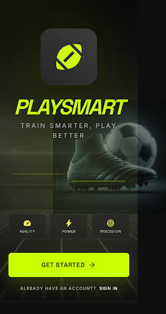
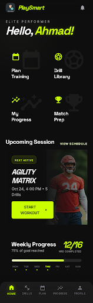
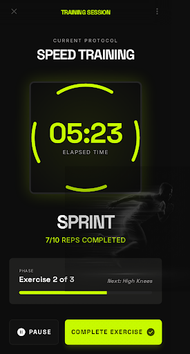
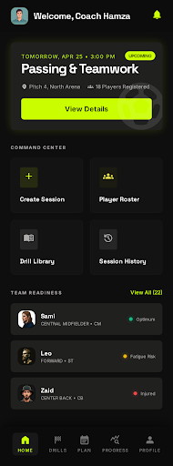
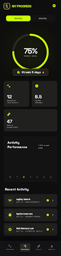

# PlaySmart: High-Performance Football Training

**PlaySmart** is a cutting-edge football training platform designed to empower athletes through data-driven insights and ethical HCI principles. This repository contains the source code for automated report generation, presentation materials, and the final design documentation for the project.

## 🚀 Project Overview

The core objective of PlaySmart is to provide real-time, actionable feedback to athletes while maintaining a high standard of usability and ethical design. The project transitioned from low-fidelity wireframes to a high-fidelity interactive prototype, meticulously mapped against Jakob Nielsen’s 10 Usability Heuristics.

### Key Features
- **Real-time Performance Tracking**: Integrated circular timers and progress bars for drill management.
- **Ethical Design**: Rejection of dark patterns like "Roach Motels" or "Privacy Zuckering."
- **Domain-Specific Iconography**: Tailored for football drills (Passing, Stamina, Tactics).
- **Automated Documentation**: Custom Python and JS scripts for generating professional HCI reports.

## 🎨 Design & Figma

The high-fidelity designs were created with a focus on **Kinetic Minimalism** and **Tonal Layering**.

- **Typography**: Space Grotesk (Modern, Technical)
- **Color Palette**: Volt Green (Action/Primary), Deep Space (Background), Pure White (Content)
- **Low fidelity design**:[https://stitch.withgoogle.com/projects/14852019868932687382]
- **Live Figma Design**: [(https://www.figma.com/design/9dZgcvMN2yNa3AUjEIUhcN/PlaySmart_Phase4)]

## 🖼️ Design Evolution: From Concept to Reality

### 1. Low-Fidelity Wireframes (Phase 3)
Early stage grayscale prototypes focused on layout and user flow, minimizing cognitive load through structural simplicity.
- **Lo-Fi Prototype**: [View on Google Stitch](https://stitch.withgoogle.com/projects/14852019868932687382)

  
  
  

### 2. High-Fidelity Design (Phase 4)
The final production-ready interface using **Volt Green** and **Space Grotesk**, implementing Jakob Nielsen’s Usability Heuristics.
- **Hi-Fi Prototype**: [View on Google Stitch](https://stitch.withgoogle.com/projects/12363635124012461076)

  
  
  

### 3. Coaching & Analytics Dashboard
Advanced data visualization for coaches to monitor athlete performance and training schedules.

  
  

## 🛠️ Tech Stack

- **Design**: Stitch (Interactive Prototyping)
- **Automation**: 
  - **Python**: Report generation (`docx`, `pdf`) and presentation compiling.
  - **Node.js**: Document assembly and screen management.
  - **PowerShell**: Utility scripts for asset organization.

## 📂 Repository Structure

- `/hifi-screenshots`: High-fidelity UI components.
- `/wireframe-images`: Early stage design concepts.
- `/scripts`: Utility scripts for data processing and report generation.
- `PlaySmart-Phase4-Report.pdf`: The final project documentation.
- `presentation_speaker_notes.md`: Script for the final HCI presentation.

---

*This project was developed as part of an HCI Design Course, focusing on the intersection of athletic performance and ethical user interfaces.*
